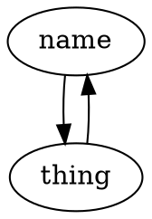
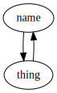
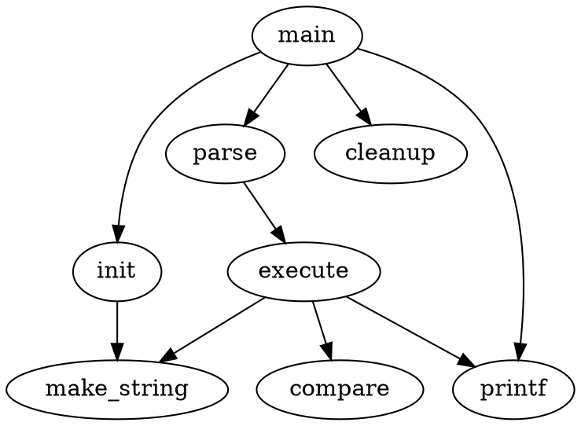
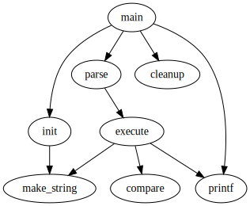

# WhAtThEdOt

# Examples
Below are some examples of fun stuff you can do with dot
## Ur average dot file
### Code

### Output:


## Example from the documentation
### Code

### Output:


# Export / Convert
Exporting can be done to `pdf` file format through the following command.
```shell
$ dot -Tpdf foo.dot -o foo.pdf
```

# Extension
Allows you to open preview of your graph to the side

# Links
| Description | Link |
| --------- | ---- |
| The dot documentation | https://graphviz.org/pdf/dotguide.pdf |
| VSCode Extension | https://marketplace.visualstudio.com/items?itemName=joaompinto.vscode-graphviz |